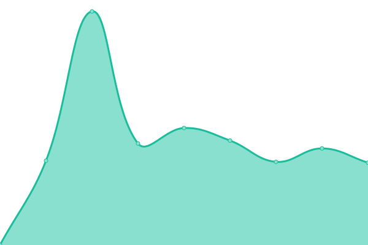

# [📈 Live Status](https://ein-tim.github.io/uptime-monitoring/): <!--live status--> **🟩 All systems operational**

This repository contains the open-source uptime monitor for [Tim's status page](https://ein-tim.github.io/uptime-monitoring/).

<!--start: status pages-->
<!-- This summary is generated by Upptime (https://github.com/upptime/upptime) -->
<!-- Do not edit this manually, your changes will be overwritten -->
<!-- prettier-ignore -->
| URL | Status | History | Response Time | Uptime |
| --- | ------ | ------- | ------------- | ------ |
|  [Andreas Einbeck](https://andreaseinbeck.de) | 🟩 Up | [andreas-einbeck.yml](https://github.com/Ein-Tim/uptime-monitoring/commits/HEAD/history/andreas-einbeck.yml) | 

 1171ms
     
 | 

<a href="https://Ein-Tim.github.io/uptime-monitoring/history/andreas-einbeck">100.00%</a>
    

|  [Holger Brüssel](https://holgerbruessel.com) | 🟩 Up | [holger-bruessel.yml](https://github.com/Ein-Tim/uptime-monitoring/commits/HEAD/history/holger-bruessel.yml) | 

 1612ms
     
 | 

<a href="https://Ein-Tim.github.io/uptime-monitoring/history/holger-bruessel">100.00%</a>
    

|  [Travelynx](https://travelynx.de) | 🟩 Up | [travelynx.yml](https://github.com/Ein-Tim/uptime-monitoring/commits/HEAD/history/travelynx.yml) | 

 888ms
     
 | 

<a href="https://Ein-Tim.github.io/uptime-monitoring/history/travelynx">100.00%</a>
    

|  [BahnExpert](https://bahn.expert) | 🟩 Up | [bahn-expert.yml](https://github.com/Ein-Tim/uptime-monitoring/commits/HEAD/history/bahn-expert.yml) | 

 1314ms
     
 | 

<a href="https://Ein-Tim.github.io/uptime-monitoring/history/bahn-expert">100.00%</a>
    

<!--end: status pages-->

  
  
  
  

## 📄 License

- Powered by: [Upptime](https://github.com/upptime/upptime)
- Code: [MIT](./LICENSE)
- Data in the `./history` directory: [Open Database License](https://opendatacommons.org/licenses/odbl/1-0/)
