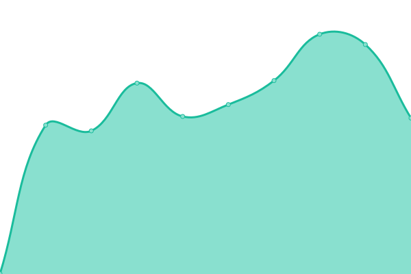
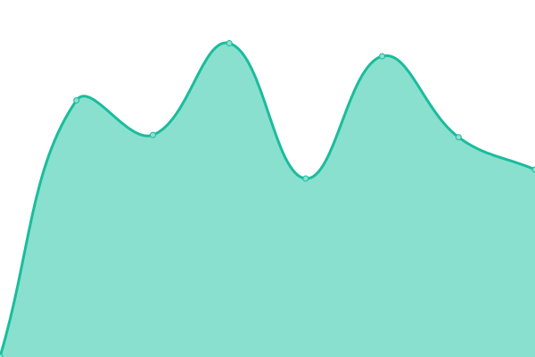

# [📈 Live Status](https://ein-tim.github.io/uptime-monitoring/): <!--live status--> **🟩 All systems operational**

This repository contains the open-source uptime monitor for [Tim's status page](https://ein-tim.github.io/uptime-monitoring/).

<!--start: status pages-->
<!-- This summary is generated by Upptime (https://github.com/upptime/upptime) -->
<!-- Do not edit this manually, your changes will be overwritten -->
<!-- prettier-ignore -->
| URL | Status | History | Response Time | Uptime |
| --- | ------ | ------- | ------------- | ------ |
|  [Corona-Warn-App website](https://www.coronawarn.app) | 🟩 Up | [corona-warn-app-website.yml](https://github.com/Ein-Tim/uptime-monitoring/commits/HEAD/history/corona-warn-app-website.yml) | 

 1260ms
     
 | 

<a href="https://Ein-Tim.github.io/uptime-monitoring/history/corona-warn-app-website">100.00%</a>
    

|  [CWA Main Server](https://svc90.main.px.t-online.de/) | 🟩 Up | [cwa-main-server.yml](https://github.com/Ein-Tim/uptime-monitoring/commits/HEAD/history/cwa-main-server.yml) | 

 831ms
     
 | 

<a href="https://Ein-Tim.github.io/uptime-monitoring/history/cwa-main-server">100.00%</a>
    

|  [CWA RAT portal](https://schnelltestportal.de) | 🟩 Up | [cwa-rat-portal.yml](https://github.com/Ein-Tim/uptime-monitoring/commits/HEAD/history/cwa-rat-portal.yml) | 

 747ms
     
 | 

<a href="https://Ein-Tim.github.io/uptime-monitoring/history/cwa-rat-portal">100.00%</a>
    

|  [CWA RAT map](https://map.schnelltestportal.de) | 🟩 Up | [cwa-rat-map.yml](https://github.com/Ein-Tim/uptime-monitoring/commits/HEAD/history/cwa-rat-map.yml) | 

 931ms
     
 | 

<a href="https://Ein-Tim.github.io/uptime-monitoring/history/cwa-rat-map">100.00%</a>
    

<!--end: status pages-->

  
  
  
  

## 📄 License

- Powered by: [Upptime](https://github.com/upptime/upptime)
- Code: [MIT](./LICENSE) © [Tim](https://github.com/Ein-Tim)
- Data in the `./history` directory: [Open Database License](https://opendatacommons.org/licenses/odbl/1-0/)
